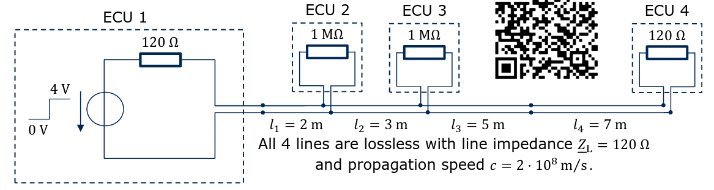

# IEEE_student_contest_2021
This is a part of the lecture "Electromagnetic compatibility". The task is to rearrange the circuit which is shown in the worst possible way

#### Rules

1. Rearrange the network above in a way that the **settle time of the new network is maximum**.
2. A network is settled if all ECU signals have reached their static mean with tolerance +- 2%
3. All 4 ECUs must be connected to each other **somehow**.
4. All 4 lines may be used, but **do not have to**.
5. Any two ECUs must be separated by at least one line.
6. Any beginning and end of a line may be connected to any number of other lines.

## transmission line 

##### propagation time
$v=s/t$  
$t=s_i/(2*10^8)$  
>$ts_1 = 2.5ns$  
$ts_2 =3.75ns$  
$ts_3 = 6.25ns$  
$ts_4 = 8.25ns$ 

### Literature transmission line

[transmission line theory](https://www.pspice.com/resources/application-notes/transmission-line-modeling)
